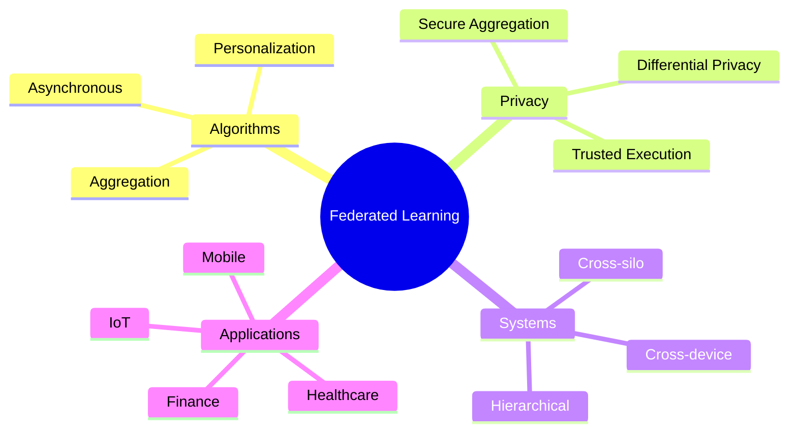
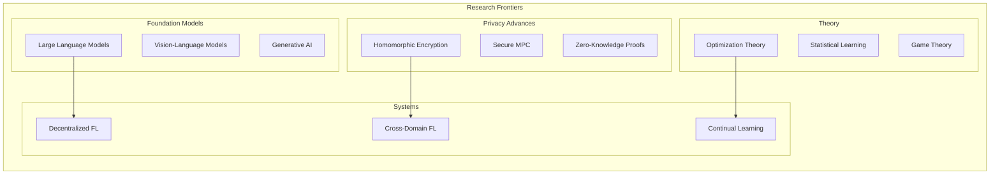

# Tutorial 200: Federated Learning Future Directions and Research Frontiers

---

## Metadata

| Property | Value |
|----------|-------|
| **Tutorial ID** | 200 |
| **Title** | Federated Learning Future Directions and Research Frontiers |
| **Category** | Advanced Topics |
| **Difficulty** | Expert |
| **Duration** | 120 minutes |
| **Prerequisites** | All previous tutorials |
| **Author** | Unbitrium Contributors |
| **Last Updated** | January 2026 |

---

## Learning Objectives

By the end of this tutorial, you will be able to:

1. **Understand** the current frontiers of federated learning research.

2. **Identify** open problems and emerging research directions.

3. **Explore** next-generation FL architectures and algorithms.

4. **Analyze** the intersection of FL with foundation models and LLMs.

5. **Consider** the societal implications and ethical challenges.

6. **Contribute** to the advancement of federated learning research.

---

## Prerequisites

Before starting this tutorial, ensure you have:

- **Completed**: All tutorials 001-199
- **Knowledge**: Deep familiarity with FL algorithms, privacy, systems
- **Experience**: Hands-on FL implementation experience

```python
# This tutorial is primarily conceptual
import unbitrium as ub
print(f"Unbitrium version: {ub.__version__}")
print("Tutorial 200: Research Frontiers")
```

---

## Background and Theory

### The Evolution of Federated Learning

Federated learning has evolved through several phases:

| Era | Focus | Key Developments |
|-----|-------|------------------|
| **2016-2018** | Foundation | FedAvg, differential privacy |
| **2019-2021** | Heterogeneity | Non-IID handling, personalization |
| **2022-2024** | Scale | Cross-silo, cross-device at scale |
| **2025+** | Foundation Models | FL for LLMs, multimodal |

### Current State-of-the-Art



### Open Challenges

| Challenge | Current Status | Gap |
|-----------|----------------|-----|
| **Heterogeneity** | Moderate solutions | Extreme non-IID |
| **Privacy** | Strong DP | Utility-privacy trade-off |
| **Efficiency** | Compression | Foundation model scale |
| **Fairness** | Emerging | Robust guarantees |
| **Verification** | Limited | Provable security |

---

## Architecture Diagram



---

## Implementation Code

### Part 1: Foundation Model Federated Learning

```python
#!/usr/bin/env python3
"""
Tutorial 200: Federated Learning Research Frontiers

This tutorial explores emerging directions in federated learning
research, including foundation models and advanced privacy.

Author: Unbitrium Contributors
License: EUPL-1.2
"""

from __future__ import annotations

from abc import ABC, abstractmethod
from dataclasses import dataclass
from typing import Any, Protocol

import numpy as np
import torch
import torch.nn as nn


# =============================================================================
# Section 1: Federated Foundation Models
# =============================================================================

@dataclass
class FoundationModelConfig:
    """Configuration for federated foundation models."""
    model_size: str = "small"  # small, base, large
    lora_rank: int = 8  # Low-rank adaptation
    num_clients: int = 100
    batch_size: int = 4  # Small for memory
    gradient_accumulation: int = 8


class LoRAAdapter(nn.Module):
    """Low-Rank Adaptation for efficient fine-tuning.

    LoRA enables federated learning of very large models
    by only training low-rank decomposed adapters.
    """

    def __init__(
        self,
        in_features: int,
        out_features: int,
        rank: int = 8,
        alpha: float = 16,
    ) -> None:
        """Initialize LoRA adapter.

        Args:
            in_features: Input dimension.
            out_features: Output dimension.
            rank: LoRA rank (small = efficient).
            alpha: LoRA scaling factor.
        """
        super().__init__()
        self.rank = rank
        self.alpha = alpha
        self.scaling = alpha / rank

        # Low-rank matrices
        self.lora_A = nn.Parameter(torch.randn(in_features, rank) * 0.01)
        self.lora_B = nn.Parameter(torch.zeros(rank, out_features))

    def forward(self, x: torch.Tensor) -> torch.Tensor:
        """Compute LoRA update."""
        return (x @ self.lora_A @ self.lora_B) * self.scaling


class FederatedLoRA:
    """Federated learning with LoRA adapters.

    Only adapter weights are communicated, reducing bandwidth
    by 100-1000x compared to full model updates.
    """

    def __init__(
        self,
        base_model: nn.Module,
        target_modules: list[str],
        rank: int = 8,
    ) -> None:
        """Initialize federated LoRA.

        Args:
            base_model: Pre-trained foundation model.
            target_modules: Module names to adapt.
            rank: LoRA rank.
        """
        self.base_model = base_model
        self.rank = rank
        self.adapters = {}

        # Freeze base model
        for param in base_model.parameters():
            param.requires_grad = False

        # Add LoRA adapters
        for name, module in base_model.named_modules():
            if any(target in name for target in target_modules):
                if hasattr(module, 'weight'):
                    in_features = module.weight.shape[1]
                    out_features = module.weight.shape[0]
                    self.adapters[name] = LoRAAdapter(
                        in_features, out_features, rank
                    )

    def get_adapter_state(self) -> dict[str, torch.Tensor]:
        """Get only adapter parameters for communication."""
        state = {}
        for name, adapter in self.adapters.items():
            state[f"{name}.lora_A"] = adapter.lora_A.data.clone()
            state[f"{name}.lora_B"] = adapter.lora_B.data.clone()
        return state

    def load_adapter_state(self, state: dict[str, torch.Tensor]) -> None:
        """Load adapter parameters from aggregated update."""
        for name, adapter in self.adapters.items():
            adapter.lora_A.data = state[f"{name}.lora_A"]
            adapter.lora_B.data = state[f"{name}.lora_B"]

    def trainable_parameters(self) -> int:
        """Count trainable parameters (adapters only)."""
        return sum(
            adapter.lora_A.numel() + adapter.lora_B.numel()
            for adapter in self.adapters.values()
        )


# Example: Federated fine-tuning efficiency
def demonstrate_lora_efficiency():
    """Show LoRA efficiency for foundation models."""
    model_sizes = {
        "GPT-2 Small (124M)": 124_000_000,
        "GPT-2 Large (774M)": 774_000_000,
        "LLaMA 7B": 7_000_000_000,
        "LLaMA 70B": 70_000_000_000,
    }

    lora_rank = 8
    target_layers = 12  # Attention layers

    print("LoRA Efficiency for Foundation Models")
    print("=" * 60)

    for name, params in model_sizes.items():
        # Estimate LoRA parameters (simplified)
        hidden_dim = int(np.sqrt(params / target_layers / 4))
        lora_params = lora_rank * hidden_dim * 2 * target_layers * 4

        reduction = params / lora_params
        print(f"{name}:")
        print(f"  Full params: {params:,}")
        print(f"  LoRA params: {lora_params:,}")
        print(f"  Reduction: {reduction:.1f}x")
        print()

    return model_sizes
```

### Part 2: Advanced Privacy Mechanisms

```python
# =============================================================================
# Section 2: Next-Generation Privacy
# =============================================================================

class SecureProtocol(Protocol):
    """Protocol for secure computation."""

    def encrypt(self, data: torch.Tensor) -> Any:
        """Encrypt data for secure computation."""
        ...

    def decrypt(self, encrypted: Any) -> torch.Tensor:
        """Decrypt result."""
        ...

    def secure_aggregate(self, encrypted_list: list[Any]) -> Any:
        """Aggregate encrypted values."""
        ...


class SimulatedHomomorphicEncryption:
    """Simulated homomorphic encryption for research.

    Note: This is a simulation for educational purposes.
    Real HE requires specialized libraries like SEAL or TenSEAL.
    """

    def __init__(self, noise_scale: float = 0.001) -> None:
        """Initialize simulated HE.

        Args:
            noise_scale: Simulated encryption noise.
        """
        self.noise_scale = noise_scale

    def encrypt(self, data: torch.Tensor) -> dict[str, torch.Tensor]:
        """Simulate encryption with additive noise."""
        noise = torch.randn_like(data) * self.noise_scale
        return {
            "ciphertext": data + noise,
            "noise_key": noise,  # Not realistic, just for simulation
        }

    def decrypt(self, encrypted: dict) -> torch.Tensor:
        """Simulate decryption."""
        return encrypted["ciphertext"] - encrypted["noise_key"]

    def homomorphic_add(
        self,
        a: dict[str, torch.Tensor],
        b: dict[str, torch.Tensor],
    ) -> dict[str, torch.Tensor]:
        """Perform addition on encrypted values."""
        return {
            "ciphertext": a["ciphertext"] + b["ciphertext"],
            "noise_key": a["noise_key"] + b["noise_key"],
        }

    def secure_aggregate(
        self,
        encrypted_list: list[dict[str, torch.Tensor]],
    ) -> dict[str, torch.Tensor]:
        """Aggregate encrypted updates."""
        result = encrypted_list[0]
        for enc in encrypted_list[1:]:
            result = self.homomorphic_add(result, enc)
        return result


class ZeroKnowledgeVerification:
    """Zero-knowledge proofs for model integrity.

    Allows verification of computation correctness
    without revealing the underlying data.
    """

    def __init__(self) -> None:
        """Initialize ZK verification."""
        self.commitments = {}

    def commit(
        self,
        client_id: int,
        model_hash: str,
        data_hash: str,
    ) -> str:
        """Create commitment to training."""
        import hashlib
        commitment = hashlib.sha256(
            f"{client_id}{model_hash}{data_hash}".encode()
        ).hexdigest()
        self.commitments[client_id] = commitment
        return commitment

    def verify(
        self,
        client_id: int,
        claimed_hash: str,
    ) -> bool:
        """Verify client commitment."""
        return self.commitments.get(client_id) == claimed_hash

    def create_proof(
        self,
        statement: str,
        witness: str,
    ) -> dict[str, Any]:
        """Create simplified ZK proof (simulated)."""
        import hashlib
        proof = {
            "statement_hash": hashlib.sha256(statement.encode()).hexdigest()[:16],
            "proof_data": hashlib.sha256(
                f"{statement}{witness}".encode()
            ).hexdigest()[:32],
        }
        return proof


# Research direction: Verifiable FL
def research_direction_verifiable_fl():
    """Explore verifiable federated learning."""
    print("\n" + "=" * 60)
    print("Research Frontier: Verifiable Federated Learning")
    print("=" * 60)

    challenges = [
        "1. Proving training was done correctly without revealing data",
        "2. Detecting malicious updates with cryptographic guarantees",
        "3. Auditing model contributions for fairness",
        "4. Enabling regulatory compliance verification",
    ]

    approaches = [
        "- Zero-knowledge proofs for gradient verification",
        "- Commitment schemes for training accountability",
        "- Verifiable computation on encrypted data",
        "- Blockchain-based audit trails",
    ]

    print("\nChallenges:")
    for c in challenges:
        print(f"  {c}")

    print("\nApproaches:")
    for a in approaches:
        print(f"  {a}")

    return challenges, approaches
```

### Part 3: Decentralized and Autonomous FL

```python
# =============================================================================
# Section 3: Decentralized Federated Learning
# =============================================================================

class DecentralizedNode:
    """Node in a fully decentralized FL network.

    No central server - nodes communicate peer-to-peer.
    """

    def __init__(
        self,
        node_id: int,
        neighbors: list[int],
        model: nn.Module,
    ) -> None:
        """Initialize decentralized node.

        Args:
            node_id: Unique node identifier.
            neighbors: IDs of neighboring nodes.
            model: Local model.
        """
        self.node_id = node_id
        self.neighbors = neighbors
        self.model = model
        self.neighbor_models: dict[int, dict[str, torch.Tensor]] = {}

    def gossip_aggregation(self) -> dict[str, torch.Tensor]:
        """Perform gossip-based aggregation with neighbors.

        Each node averages its model with received neighbor models.
        """
        local_state = self.model.state_dict()
        all_states = [local_state] + list(self.neighbor_models.values())

        averaged = {}
        for key in local_state.keys():
            averaged[key] = torch.stack([s[key] for s in all_states]).mean(dim=0)

        return averaged

    def receive_from_neighbor(
        self,
        neighbor_id: int,
        state: dict[str, torch.Tensor],
    ) -> None:
        """Receive model from neighbor."""
        if neighbor_id in self.neighbors:
            self.neighbor_models[neighbor_id] = state


class DecentralizedNetwork:
    """Fully decentralized FL network."""

    def __init__(
        self,
        num_nodes: int,
        topology: str = "ring",
        model_factory: callable = None,
    ) -> None:
        """Initialize decentralized network.

        Args:
            num_nodes: Number of nodes.
            topology: Network topology ('ring', 'random', 'complete').
            model_factory: Function to create models.
        """
        self.num_nodes = num_nodes
        self.topology = topology

        # Build adjacency
        adjacency = self._build_topology(num_nodes, topology)

        # Create nodes
        self.nodes = []
        for i in range(num_nodes):
            neighbors = [j for j, connected in enumerate(adjacency[i]) if connected]
            model = model_factory() if model_factory else nn.Linear(10, 2)
            node = DecentralizedNode(i, neighbors, model)
            self.nodes.append(node)

    def _build_topology(
        self,
        n: int,
        topology: str,
    ) -> np.ndarray:
        """Build network adjacency matrix."""
        adj = np.zeros((n, n), dtype=bool)

        if topology == "ring":
            for i in range(n):
                adj[i, (i + 1) % n] = True
                adj[i, (i - 1) % n] = True
        elif topology == "complete":
            adj = np.ones((n, n), dtype=bool)
            np.fill_diagonal(adj, False)
        elif topology == "random":
            # Erdos-Renyi random graph
            for i in range(n):
                for j in range(i + 1, n):
                    if np.random.random() < 0.3:
                        adj[i, j] = adj[j, i] = True

        return adj

    def gossip_round(self) -> None:
        """Perform one round of gossip communication."""
        # Each node sends its model to neighbors
        for node in self.nodes:
            state = node.model.state_dict()
            for neighbor_id in node.neighbors:
                self.nodes[neighbor_id].receive_from_neighbor(node.node_id, state)

        # Each node aggregates
        for node in self.nodes:
            aggregated = node.gossip_aggregation()
            node.model.load_state_dict(aggregated)
            node.neighbor_models.clear()


# =============================================================================
# Section 4: Future Research Directions
# =============================================================================

def outline_research_frontiers() -> dict[str, list[str]]:
    """Outline key research frontiers in federated learning."""

    frontiers = {
        "Foundation Models": [
            "Federated pre-training of LLMs",
            "Efficient adapter-based fine-tuning",
            "Federated RLHF for alignment",
            "Multimodal federated learning",
            "Federated retrieval-augmented generation",
        ],
        "Privacy": [
            "Practical homomorphic encryption for ML",
            "Multi-party computation at scale",
            "Zero-knowledge ML verification",
            "Privacy-utility Pareto optimality",
            "Vertical federated learning with privacy",
        ],
        "Systems": [
            "Serverless federated learning",
            "Quantum-resistant FL protocols",
            "Decentralized autonomous FL",
            "Cross-silo data marketplaces",
            "Real-time streaming FL",
        ],
        "Theory": [
            "Tight convergence bounds for non-IID",
            "Sample complexity of federated learning",
            "Game-theoretic incentive mechanisms",
            "Fairness in federated optimization",
            "Causal inference in federated settings",
        ],
        "Applications": [
            "Federated drug discovery",
            "Global climate modeling",
            "Federated financial crime detection",
            "Privacy-preserving genomics",
            "Collaborative robotics learning",
        ],
    }

    print("\n" + "=" * 60)
    print("Federated Learning Research Frontiers")
    print("=" * 60)

    for area, topics in frontiers.items():
        print(f"\n{area}:")
        for topic in topics:
            print(f"  • {topic}")

    return frontiers


def generate_research_agenda() -> None:
    """Generate research agenda for next 5 years."""

    print("\n" + "=" * 60)
    print("5-Year Research Agenda for Federated Learning")
    print("=" * 60)

    agenda = {
        "2026": [
            "Establish benchmarks for federated foundation models",
            "Standardize privacy accounting across algorithms",
            "Deploy first production federated LLM systems",
        ],
        "2027": [
            "Achieve practical homomorphic encryption for FL",
            "Decentralized FL protocols for Web3 applications",
            "Federated learning for general-purpose robotics",
        ],
        "2028": [
            "Global-scale federated climate models",
            "Privacy-preserving federated genomics at population scale",
            "Verified federated learning with formal guarantees",
        ],
        "2029": [
            "Autonomous federated systems with self-governance",
            "Cross-modality federated reasoning systems",
            "Federated quantum machine learning",
        ],
        "2030": [
            "Universal federated AI assistants",
            "Global federated knowledge graphs",
            "Provably fair and private federated systems",
        ],
    }

    for year, goals in agenda.items():
        print(f"\n{year}:")
        for goal in goals:
            print(f"  → {goal}")


# Main demonstration
if __name__ == "__main__":
    # Demonstrate LoRA efficiency
    demonstrate_lora_efficiency()

    # Explore verifiable FL
    research_direction_verifiable_fl()

    # Outline frontiers
    outline_research_frontiers()

    # Generate agenda
    generate_research_agenda()

    print("\n" + "=" * 60)
    print("Thank you for completing the Unbitrium Tutorial Series!")
    print("=" * 60)
```

---

## Metrics and Evaluation

### Research Impact Metrics

| Metric | Description | Benchmark |
|--------|-------------|-----------|
| **Publications** | Top-tier papers | NeurIPS, ICML, ICLR |
| **Adoption** | Industry deployment | 100+ organizations |
| **Standards** | Protocol standardization | IEEE, W3C |
| **Open Source** | Community contributions | GitHub stars |

### Maturity Assessment

| Area | Current TRL | Target TRL |
|------|-------------|------------|
| Cross-device FL | 9 | 9 |
| Privacy-preserving FL | 6-7 | 9 |
| Federated LLMs | 3-4 | 8 |
| Decentralized FL | 4-5 | 8 |

---

## Exercises

### Exercise 1: Research Proposal

**Task**: Write a 1-page research proposal for a novel federated learning problem.

### Exercise 2: Open Problem Analysis

**Task**: Select one open problem and analyze current approaches and gaps.

### Exercise 3: System Design

**Task**: Design a federated foundation model training system for 1000 organizations.

### Exercise 4: Contribute to Unbitrium

**Task**: Implement a new algorithm in Unbitrium and submit a pull request.

---

## References

1. Kairouz, P., et al. (2021). Advances and open problems in federated learning. *Foundations and Trends in ML*.

2. Wang, J., et al. (2021). A field guide to federated optimization. *arXiv*.

3. Hu, E. J., et al. (2022). LoRA: Low-rank adaptation of large language models. In *ICLR*.

4. Liu, Y., et al. (2022). No one left behind: Inclusive federated learning over heterogeneous devices. In *KDD*.

5. Xu, J., et al. (2023). Federated fine-tuning of LLMs with private data. *arXiv*.

6. Bonawitz, K., et al. (2019). Towards federated learning at scale: A system design. In *MLSys*.

7. McMahan, H. B., et al. (2017). Communication-efficient learning of deep networks from decentralized data. In *AISTATS*.

---

## Conclusion

This tutorial concludes the comprehensive Unbitrium tutorial series. You have explored:

- **200 tutorials** covering all aspects of federated learning
- **Foundational concepts** through advanced research frontiers
- **Practical implementations** with working code
- **Theoretical foundations** with mathematical rigor

The field of federated learning continues to evolve rapidly. We encourage you to:

1. **Contribute** to open-source FL projects like Unbitrium
2. **Publish** your research findings
3. **Apply** FL to new domains and problems
4. **Collaborate** with the global FL research community

Thank you for learning with Unbitrium!

---

*Copyright 2026 Olaf Yunus Laitinen Imanov and Contributors. Released under EUPL 1.2.*
