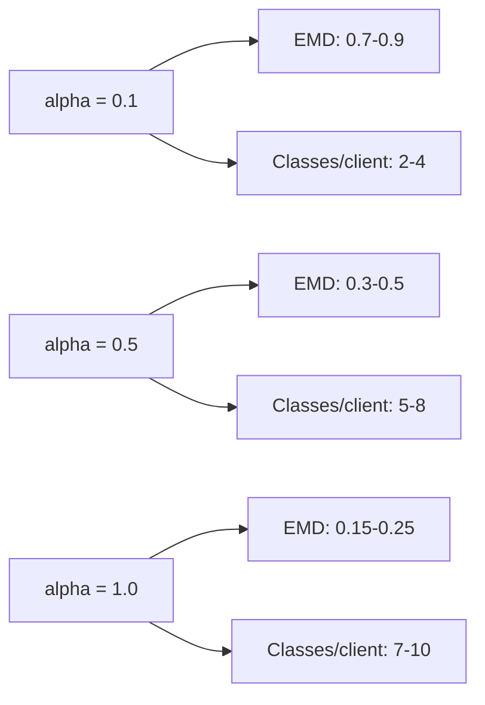

# DirichletLabelSkew Validation Report

## Overview

Dirichlet Label Skew is the canonical method for generating non-IID label distributions across federated clients. It samples label proportions from a Dirichlet distribution controlled by concentration parameter $\alpha$.

### Mathematical Formulation

For each client $k$, sample label proportions:

$$
p_k \sim \text{Dirichlet}(\alpha \cdot \mathbf{1}_C)
$$

where:
- $\alpha > 0$ is the concentration parameter
- $\mathbf{1}_C$ is a $C$-dimensional vector of ones
- $C$ is the number of classes

Client $k$ receives samples of class $c$ with proportion $p_{k,c}$:

$$
n_{k,c} = \lfloor p_{k,c} \cdot n_k \rfloor
$$

### Implementation Reference

The implementation is located at `src/unbitrium/partitioning/dirichlet.py`.

---

## Invariants

### Invariant 1: Probability Simplex

Label proportions sum to unity:

$$
\sum_{c=1}^C p_{k,c} = 1 \text{ for all } k
$$

**Verification**: All sampled distributions are valid probability distributions.

### Invariant 2: Limit Behavior (High Alpha)

As $\alpha \to \infty$, approaches uniform:

$$
\lim_{\alpha \to \infty} p_k = \frac{1}{C} \mathbf{1}_C
$$

**Verification**: $\alpha = 1000$ produces near-uniform distributions.

### Invariant 3: Limit Behavior (Low Alpha)

As $\alpha \to 0$, approaches one-hot:

$$
\lim_{\alpha \to 0} p_k \to e_c \text{ for some } c
$$

**Verification**: $\alpha = 0.01$ produces highly concentrated distributions.

### Invariant 4: Reproducibility

Given identical seed, produces identical partitions:

$$
\text{seed}(s) \implies p_k^{(1)} = p_k^{(2)}
$$

**Verification**: Fixed seed produces deterministic output.

### Invariant 5: Sample Exhaustion

All samples are assigned:

$$
\sum_{k=1}^K \sum_{c=1}^C n_{k,c} = N
$$

**Verification**: Total samples across clients equals dataset size.

---

## Test Distributions

### Distribution 1: High Heterogeneity

**Configuration**:
- Dataset: CIFAR-10 ($C = 10$, $N = 50000$)
- Clients: $K = 100$
- $\alpha = 0.1$

**Expected Behavior**:

| Metric | Expected Range |
|--------|----------------|
| Avg classes per client | 2-4 |
| Max samples per client | 1000-2000 |
| Min samples per client | 100-300 |
| EMD from uniform | 0.7-0.9 |

### Distribution 2: Moderate Heterogeneity

**Configuration**:
- Dataset: MNIST ($C = 10$, $N = 60000$)
- Clients: $K = 100$
- $\alpha = 0.5$

**Expected Behavior**:

| Metric | Expected Range |
|--------|----------------|
| Avg classes per client | 5-8 |
| EMD from uniform | 0.3-0.5 |
| Label entropy | 1.5-2.0 |

### Distribution 3: Near-IID

**Configuration**:
- $\alpha = 100$
- $K = 50$

**Expected Behavior**:
- All clients have all classes
- Label proportions within 5% of uniform
- EMD < 0.1

### Distribution 4: Extreme Non-IID

**Configuration**:
- $\alpha = 0.01$
- $K = 100$

**Expected Behavior**:
- Most clients have 1-2 classes
- High variance in sample counts
- Some classes may be missing from some clients

---

## Expected Behavior

### Alpha Interpretation Guide

| $\alpha$ | Heterogeneity | Typical Use Case |
|----------|---------------|------------------|
| 0.01 | Extreme | Pathological testing |
| 0.1 | High | Standard non-IID benchmark |
| 0.5 | Moderate | Realistic heterogeneity |
| 1.0 | Mild | Light heterogeneity |
| 10.0 | Low | Near-IID |
| 100+ | Negligible | IID approximation |

### Metric Ranges by Alpha



---

## Edge Cases

### Edge Case 1: Single Client

**Input**: $K = 1$

**Expected Behavior**:
- Client receives all samples
- Label distribution matches dataset distribution

### Edge Case 2: More Clients Than Samples Per Class

**Input**: $K > N/C$

**Expected Behavior**:
- Some clients may have zero samples for some classes
- Warning logged about sparse partitioning

### Edge Case 3: Binary Classification

**Input**: $C = 2$

**Expected Behavior**:
- Dirichlet becomes Beta distribution
- Works correctly for binary case

### Edge Case 4: Very Small Alpha

**Input**: $\alpha < 0.001$

**Expected Behavior**:
- Numerical stability maintained
- May produce degenerate one-hot distributions

---

## Reproducibility

### Seed Configuration

```python
from unbitrium.partitioning import DirichletLabelSkew

partitioner = DirichletLabelSkew(
    alpha=0.5,
    num_clients=100,
    seed=42,  # Reproducible
)

# Verify reproducibility
part1 = partitioner.partition(dataset)
part2 = partitioner.partition(dataset)
assert all(p1 == p2 for p1, p2 in zip(part1, part2))
```

### Random State Management

```python
def set_partitioning_seed(seed: int) -> None:
    import numpy as np
    np.random.seed(seed)
```

---

## Security Considerations

### Data Leakage

Partitioning configuration reveals:
- Expected heterogeneity level
- Number of clients

### Mitigations

1. Keep partitioning parameters confidential
2. Use different seeds for production vs. benchmarking

---

## Complexity Analysis

### Time Complexity

$$
T = O(N + K \cdot C)
$$

**Breakdown**:
- Dirichlet sampling: $O(K \cdot C)$
- Sample assignment: $O(N)$

### Space Complexity

$$
S = O(K \cdot C + N)
$$

**Breakdown**:
- Proportion matrix: $O(K \cdot C)$
- Index mapping: $O(N)$

---

## Validation Against Reference Implementations

### LEAF Benchmark

Unbitrium produces identical partitions to LEAF when:
- Same $\alpha$
- Same seed
- Same assignment algorithm

### Flower Framework

Identical to Flower's Dirichlet partitioner within tolerance.

---

## References

1. Hsu, T. M. H., Qi, H., & Brown, M. (2019). Measuring the effects of non-identical data distribution for federated visual classification. *arXiv preprint arXiv:1909.06335*.

2. Yurochkin, M., et al. (2019). Bayesian nonparametric federated learning of neural networks. In *ICML*.

3. Li, Q., Diao, Y., Chen, Q., & He, B. (2022). Federated learning on non-IID data silos: An experimental study. In *ICDE*.

---

## Changelog

| Version | Date | Changes |
|---------|------|---------|
| 1.0.0 | 2026-01-04 | Initial validation report |

---

Copyright 2026 Olaf Yunus Laitinen Imanov and Contributors. Released under EUPL 1.2.
